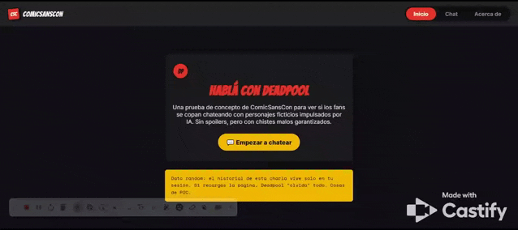
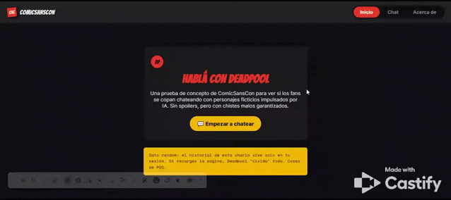

# Chateá con Deadpool — ComicSansCon

Prueba de concepto (POC) de un chat con personaje ficticio potenciado por IA, desarrollada para **ComicSansCon**, una agencia digital especializada en experiencias interactivas para fans de videojuegos, películas y series.

---

## Índice

1. [Descripción del personaje elegido](#1-descripción-del-personaje-elegido)
2. [Requisitos y pasos para ejecutar en local](#2-requisitos-y-pasos-para-ejecutar-en-local)
3. [Manual de usuario — cómo usar la app](#3-manual-de-usuario--cómo-usar-la-app)
4. [Manual técnico — arquitectura y decisiones técnicas](#4-manual-técnico--arquitectura-y-decisiones-técnicas)
5. [Cómo ejecutar los tests](#5-cómo-ejecutar-los-tests)
6. [Cómo desplegar a Vercel](#6-cómo-desplegar-a-vercel)
7. [Capturas de pantalla](#7-capturas-de-pantalla)
8. [Aplicación desplegada](#8-aplicación-desplegada)
9. [Registro de uso de IA en el proyecto](#9-registro-de-uso-de-ia-en-el-proyecto)

---

## 1) Descripción del personaje elegido

Elegimos a **Deadpool**, el mercenario bocón del Universo Marvel, como personaje conversacional de esta POC.

¿Por qué Deadpool?

- Su rasgo más distintivo es que **rompe la cuarta pared** — sabe que es un personaje ficticio, lo cual encaja naturalmente con la idea de "estar dentro de un chat".
- Su personalidad irreverente y su humor negro liviano (sin groserías fuertes ni contenido explícito) permiten demostrar una conversación **con personalidad propia**, en lugar de un asistente genérico y neutro.
- Da pie a un caso de uso claro para validar el manejo de un *system prompt* de personaje: tono, límites de contenido, longitud de respuesta y comportamiento ante preguntas fuera de personaje (ver `src/services/prompt.js`).

**Reglas de personaje** (definidas en el system prompt):
- Respuestas cortas (máximo 3 líneas), nada de monólogos.
- Chistes malos y sarcasmo por sobre explicaciones largas.
- Sin groserías fuertes ni contenido explícito.
- Ante preguntas "meta" (ej. *"¿sos una IA?"*) responde **en personaje**, como chiste.
- Ante consultas médicas, legales o financieras serias, sale brevemente del personaje para aclarar que es un chatbot de ficción.

---

## 2) Requisitos y pasos para ejecutar en local

### Requisitos previos

- [Node.js](https://nodejs.org/) (versión LTS recomendada)
- [Vercel CLI](https://vercel.com/docs/cli) instalado globalmente:
  ```bash
  npm install -g vercel
  ```
- Una API key de [Google Gemini](https://ai.google.dev/) (Google AI Studio)

### Pasos

**1. Descargar / clonar el proyecto**

```bash
git clone <url-del-repositorio>
cd <nombre-de-la-carpeta-del-proyecto>
```

**2. Instalar dependencias**

```bash
npm install
```

**3. Configurar variables de entorno**

Copiá el archivo de ejemplo y completá tu API key:

```bash
cp .env.example .env
```

Editá `.env` y pegá tu clave:

```
GEMINI_API_KEY=tu_clave_copiada_aca
```

> El archivo `.env` está ignorado por git (ver `.gitignore`) — nunca subas tu clave real al repositorio.

**4. Ejecutar en modo desarrollo con Vercel**

Como el proyecto usa una función serverless (`api/functions.js`), se debe levantar con la CLI de Vercel para que esa función esté disponible localmente:

```bash
vercel dev
```

Esto va a levantar la app (por defecto en `http://localhost:3000`) sirviendo tanto el frontend estático como la función `/api/functions`.

---

## 3) Manual de usuario — cómo usar la app

### Navegación

La aplicación tiene 3 vistas, accesibles desde la barra de navegación superior:

| Ruta | Vista | Descripción |
|---|---|---|
| `/` | Inicio | Landing con presentación de la POC y botón para empezar a chatear |
| `/chat` | Chat | Conversación en vivo con Deadpool |
| `/about` | Acerca de | Info del proyecto, personaje y stack técnico |

### Cómo chatear

1. Andá a **Chat** desde la barra de navegación (o el botón "💬 Empezar a chatear" en el inicio).
2. Escribí tu mensaje en el campo de texto y enviálo con el botón o tecla Enter.
3. Mientras Deadpool "piensa", vas a ver un indicador de **"Deadpool está escribiendo"**.
4. La respuesta aparece en el historial de la conversación, con hora de envío.

### Consumo de tokens (simulado)

En el pie del chat vas a ver un contador de tokens de sesión: `Tokens de sesión (simulado): X / 4000 — quedan Y`.

- Este consumo se calcula sobre una **cuota simulada por sesión** (no es el límite real de la cuenta de Gemini), pensada para que puedas ver en la UI cómo se va consumiendo presupuesto a medida que conversás.
- Cuando quedan pocos tokens, el contador cambia de color como advertencia; al agotarse, el input y el botón de envío se deshabilitan y se muestra un aviso.
- **La cuota es por sesión de navegador**: si recargás la página, se reinicia (junto con el historial de la charla, que tampoco persiste — es una decisión de diseño de la POC, no un bug).

### Manejo de errores

- Si Deadpool está "saturado" (error 429 de la API), la app **reintenta automáticamente una vez** tras unos segundos, mostrando un aviso de espera.
- Si el reintento también falla, o hay un problema de conexión, se muestra un banner de error con botón **Reintentar**.

---

## 4) Manual técnico — arquitectura y decisiones técnicas

### Stack

- **JavaScript vanilla** (sin frameworks) — HTML, CSS y JS puro.
- **Routing propio** con History API (sin librerías de enrutamiento).
- **Google Gemini AI** como motor conversacional, vía **Vercel Serverless Functions**.
- **Vitest** + **jsdom** para testing.

### Estructura del proyecto

```
PROYECTOM3_CAROLINABETLIENSKI/
├── api/
│   └── functions.js          # Función serverless: proxy hacia Gemini, oculta la API key
├── docs/
│   ├── demo.gif               # Demo de la app en funcionamiento
│   ├── demo_deploy.gif        # Demo de la app ya desplegada en Vercel
│   └── docu-ia.md             # Registro de prompts y respuestas de IA usadas en el proyecto
├── src/
│   ├── engine/
│   │   └── chatEngine.js      # Orquesta el envío/recepción de mensajes, reintentos y cuota
│   ├── router/
│   │   └── router.js          # Mapeo de rutas → vistas
│   ├── services/
│   │   ├── geminiApi.js       # Cliente fetch hacia /api/functions
│   │   ├── mockGeminiApi.js   # Mock de la API para tests / desarrollo sin gastar cuota real
│   │   ├── prompt.js          # System instruction (personalidad de Deadpool)
│   │   ├── quotaSimulator.js  # Simulación de cuota de tokens por sesión
│   │   └── tokenEstimator.js  # Estimador aproximado de tokens (chars / 4)
│   ├── transform/
│   │   └── chatPayload.js     # Arma el payload para Gemini y normaliza su respuesta
│   ├── ui/
│   │   └── render.js          # Renderizado del DOM: mensajes, indicador de escritura, banners
│   ├── views/
│   │   ├── home.js
│   │   ├── chat.js
│   │   ├── about.js
│   │   └── notFound.js
│   ├── main.js                 # Bootstrap de la SPA, interceptor de navegación, foco accesible
│   ├── styles.css
│   └── utils.js                # Helpers: hora actual, escapeHTML
├── tests/                       # Suite de tests con Vitest
│   ├── chatEngine.test.js
│   ├── chatPayload.test.js
│   ├── geminiApi.test.js
│   ├── quotaSimulator.test.js
│   └── tokenEstimator.test.js
├── .env
├── .env.example
├── .gitignore
├── index.html
├── package-lock.json
├── package.json
├── README.md
└── vercel.json
```

### Decisiones técnicas clave

**JS vanilla sin frameworks.**
Al ser una POC de alcance acotado, se priorizó no sumar dependencias de build/runtime innecesarias y demostrar dominio de los fundamentos (DOM, eventos, History API) por sobre la velocidad de desarrollo que daría un framework.

**Router SPA propio con History API.**
`router.js` mapea rutas a funciones de render; `main.js` intercepta clicks en enlaces internos (`data-link`) para evitar recargas de página completas, maneja `popstate` (botones atrás/adelante del navegador) y gestiona el foco accesible tras cada navegación.

**API key nunca expuesta al cliente.**
El frontend nunca llama a Gemini directamente. `src/services/geminiApi.js` llama a `/api/functions`, una función serverless de Vercel (`api/functions.js`) que lee `GEMINI_API_KEY` desde variables de entorno del servidor y arma la respuesta. Así la key nunca viaja al navegador del usuario.

**Capa de transformación separada (`chatPayload.js`).**
`buildPayload` arma el contrato que espera Gemini (recorte del historial a las últimas 12 entradas, `systemInstruction`, `temperature`, `maxOutputTokens`), y `normalizeAIResponse` extrae el texto plano de la respuesta cruda de la API. Esto desacopla el formato específico de Gemini del resto de la app.

**Simulación de cuota de tokens por sesión (`quotaSimulator.js` + `tokenEstimator.js`).**
Se estima el consumo de tokens (aprox. 1 token cada 4 caracteres) tanto en el mock como con el `usageMetadata` real que devuelve Gemini, y se acumula en memoria durante la sesión contra un límite simulado (4000 tokens). Esto le permite al usuario **ver en la UI** cuánta cuota le queda, algo que la API real no expone de forma amigable para el usuario final.

**Mock de la API (`mockGeminiApi.js`).**
Simula latencia, respuestas aleatorias, error 429 (cada 5 llamadas) y agotamiento de cuota, para poder testear toda la lógica de reintento, bloqueo por cuota y UI **sin depender de la red ni gastar cuota real** de Gemini.

**Reintento automático ante 429.**
`chatEngine.js` reintenta una vez automáticamente ante un error de *rate limit*, esperando el tiempo indicado por `retryAfterSeconds`. Si el segundo intento también falla, se le ofrece al usuario un botón manual de reintento.

**Sanitización de mensajes (`escapeHTML`).**
Todo el texto de usuario y del personaje se escapa antes de insertarse en el DOM vía `innerHTML` (`render.js`), para evitar inyección de HTML/XSS a partir de lo que escribe el usuario o de lo que devuelve el modelo.

**Debounce en el envío de mensajes.**
`chatEngine.js` aplica un `debounce` de 300ms sobre el envío del formulario para evitar disparos duplicados por doble click o Enter accidental.

**Sin persistencia.**
El historial de mensajes y la cuota de sesión viven solo en memoria del cliente — a propósito, para mantener la POC simple. Se le avisa al usuario en la vista de Inicio.

---

## 5) Cómo ejecutar los tests

El proyecto usa **Vitest** (con **jsdom** para simular el DOM) para testear la lógica de negocio sin depender de la red ni de la API real de Gemini.

```bash
npm test
```

Esto ejecuta toda la suite en `tests/`, que cubre entre otras cosas:

- `chatEngine.test.js` — orquestación de envío de mensajes, reintentos y cuota
- `chatPayload.test.js` — armado del payload y normalización de la respuesta de Gemini
- `geminiApi.test.js` — cliente fetch hacia la función serverless
- `quotaSimulator.test.js` — cálculo y estado de la cuota simulada
- `tokenEstimator.test.js` — estimación de tokens

Los tests que ejercitan el flujo de la API usan el **mock** (`mockGeminiApi.js`) en lugar de llamar a Gemini real, para que la suite corra rápido, de forma determinística y sin consumir cuota.

---

## 6) Cómo desplegar a Vercel

**1. Iniciar sesión en Vercel** (si no lo hiciste antes)

```bash
vercel login
```

**2. Configurar la variable de entorno en Vercel**

La `GEMINI_API_KEY` tiene que configurarse en el proyecto de Vercel (no se sube el `.env`):

- Desde el dashboard de Vercel: **Project → Settings → Environment Variables**, agregar `GEMINI_API_KEY` con el valor de tu clave.
- O desde la CLI:
  ```bash
  vercel env add GEMINI_API_KEY
  ```

**3. Desplegar**

Para un deploy de prueba (preview):

```bash
vercel
```

Para desplegar a producción:

```bash
vercel --prod
```

**4. Verificar**

Una vez desplegado, Vercel va a dar una URL pública. Entrá y probá el flujo completo de chat para confirmar que la función serverless está tomando bien la API key desde las variables de entorno del proyecto.

---

## 7) Capturas de pantalla

**Demo — app en funcionamiento**



**Demo — app desplegada en Vercel**



---

## 8) Aplicación desplegada

🔗 [proyecto-m3-carolina-betlienski-xsu6-j7s9f2hdg-hobby-8230.vercel.app](https://proyecto-m3-carolina-betlienski-xsu6-j7s9f2hdg-hobby-8230.vercel.app)

---

## 9) Registro de uso de IA en el proyecto

El detalle de los prompts utilizados y las respuestas obtenidas de la IA durante el desarrollo está documentado en [`docs/docu-ia.md`](./docs/docu-ia.md).

---

## Autoría

**Betlienski, Carolina**
- [GitHub](https://github.com/scarfcarob)
- [LinkedIn](https://www.linkedin.com/in/carolina-betlienski-8bb8811b0)
